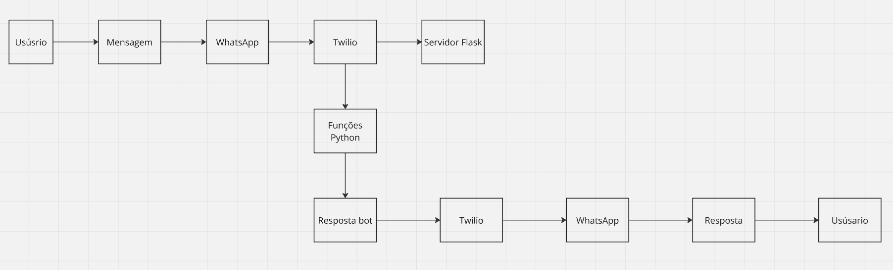

# Projeto ChatBot do Turbo Racing

Este projeto é um chatbot interativo para o WhatsApp sobre a Fórmula E, desenvolvido utilizando Python, Flask, Twilio e Ngrok. O chatbot fornece informações sobre pilotos, equipes, termos técnicos, regulamento e curiosidades da Fórmula E.

## Funcionalidades 
    Envio de mensagem de boas-vindas via WhatsApp utilizando Twilio.
    Integração com Flask para receber e responder mensagens dos usuários.

    O chatbot responde a comandos específicos enviados pelo usuário, oferecendo informações detalhadas sobre:
    Pilotos: Classificação dos pilotos com nome, equipe e pontos.
    Equipes: Lista de equipes, pilotos e modelos de carros.
    Termos Técnicos: Definições de termos importantes da Fórmula E.
    Regulamento: Regras e mudanças na competição.
    Curiosidades: Fatos interessantes sobre a temporada e a competição.
    Detalhes dos Pilotos: Informações completas sobre os principais pilotos.
    
##  Tecnologias Utilizadas
    Python: Linguagem principal para o desenvolvimento do projeto.
    Twilio: API para envio e recebimento de mensagens via WhatsApp.
    Flask: Framework para criar a aplicação web que recebe e responde mensagens.
    Ngrok: Ferramenta para criar um túnel HTTP público que expõe o servidor local, permitindo a integração com Twilio.

## Requisitos
    Python 3.x
    Conta no Twilio com número de WhatsApp verificado
    Ngrok para expor a aplicação Flask
    Pacotes Python:
     Flask
     twilio

## Instalação e Execução

### 1. Clonar o Repositório
    git clone https://github.com/matheuscantiere/sprint-python2.git

    cd seu-repositorio

### 2. Instalar as Dependências
    pip install twilio
    pip install Flask

### 3. Configuracao do Twilio
#### 3.1 Criar Conta no Twilio
    Nao precisa colocar a autentificacao de 2 fatores

    

#### 3.2 Adicionar Numero de Telefone

#### 3.3 Codigo de seguranca
    Coloque o codique que chegara atraves do seu numero de celular

#### 3.4 Salvar Codigo de Recuperacao
    salve este codigo para conseguir recuperar sua conta caso algo aconteca com ela

#### 3.5 Colocar Informacoes
    Coloque as informacoes necessarias para poder seguir com o cadastro

#### 3.6 Clique em Account Dashboard
    Clique em Account Dashboard para pegar alguns dados necessarios

#### 3.7 Pegar o SID e o AUTH TOKEN
    Pegue o SID e o AUTH TOKEN para poder substituir no codigo

#### 3.8 Logar com whatsapp
    Clique em send a whatsapp message para poder logar com seu whatsapp e consegui mandar mensagens

#### 3.9 QrCode
    Escaneie o qr code para poder abrir seu whatsapp

#### 3.10 Enviar mensagem pré selecionada
    Envie a mensagem que o teilio colocou para voce

### 4. Configuracao do ngrok
#### 4.1 Crie uma conta na ngrok

#### 4.2 Adicionando Informacoes no Ngrok
    Colocando informacoes no ngrok para proseguir no login

#### 4.3 Instalacao Ngrok
    Instale o Ngrok de acordo com seu sistema operacional

#### 4.4 Executando Ngrok
    Apos baixar e extrar o ngrok execute o arquivo para poder terminar de configurar

#### 4.5 Clique em YOURAUTHOKEN
    Clique em yourauthoken para consegui pegar seu token

#### 4.6 Copie seu Token para poder autenticar
    Copie seu token para poder autenticar no cmd do ngrok

#### 4.7 Autenticando seu token no cmd do ngrok
    Apos executar o Ngrok execute o comando "ngrok config add-authtoken SEU TOKEN"

#### 4.8 Iniciando o ngrok 
    apos autenticar seu token, digite o comando "ngrok http 5000" para poder iniciar o ngrok

#### 4.9 Copiando Url e colocando no twilio para poder rodar
    Copie a url que o ngrok ira disponibilizar e coloque no twilio para ligar com seu whatsapp

#### 4.10 Colocando a url no twilio
    coloque a url que o ngrok gerou no twilio no final coloque   https://seu-ngrok-url.ngrok.io/whatsapp para conseguir se conectar

### 5 Configurando Codigo python
### 5.1 COlocando suas informacoes no codigo python
    Coloque suas informacoes do sid e o auth token no codigo python para conseguir conectar, tambem coloque seu numero de celular com o ddd para a mensagem chegar para voce

### 5.2 Executando Projeto
    Execute o projeto python em sua maquina, após executar o twilio enviara uma mensagens personalizada de boas vindas, após isso voce ja pode colocar alguns topicos que temos para ver algumas informacoes sobre a formula E
    Tambem pode executar com o comando  python app.py no terminal do VsCode

### 5.3 Confirmacoes no cmd do ngrok
    Caso de tudo certo quando voce enviar a mensagem no whatsapp recebera uma confirmacao no cmd do ngrok

### 6. Testar o Chatbot

    Envie mensagens no WhatsApp para o número verificado com os seguintes comandos:

    "pilotos": Exibe a classificação dos pilotos.
    "equipes": Mostra as equipes e carros da Fórmula E.
    "termos": Explica termos técnicos importantes da competição.
    "regulamento": Exibe as principais regras e mudanças da temporada.
    "curiosidades": Fatos interessantes sobre a Fórmula E.
    "detalhes": Informações detalhadas dos principais pilotos.

## Diagrama de Blocos

## Autores

- Enzo Valieres (RM555119)
- Gilherme Barbiero(RM 555185)
- Matheus Cantiere (RM558479)
- Pedro de Lorenzo (RM554720)
- Vinicius Castro (RM556137)

